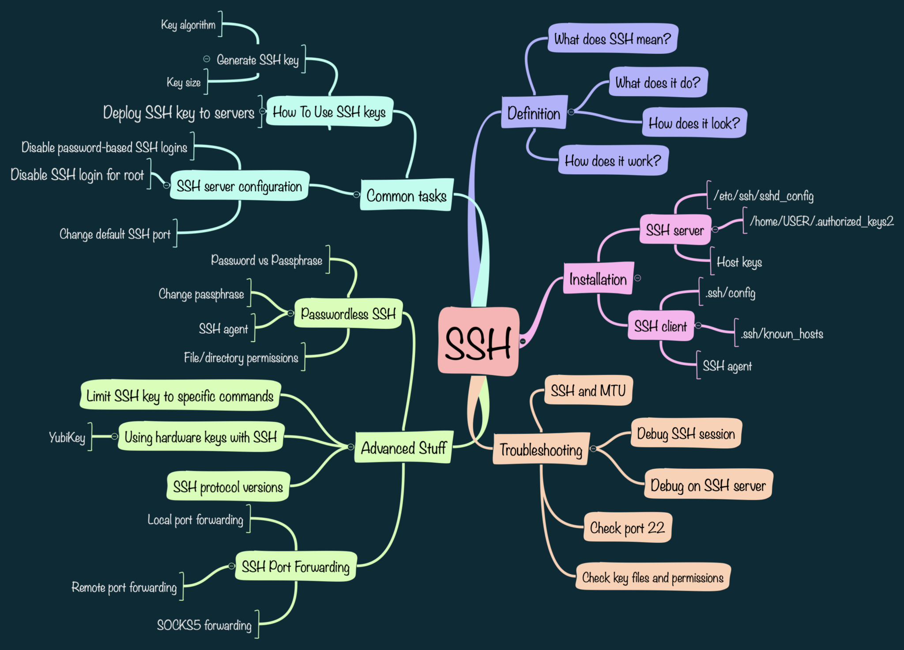

# How to Create a Technical Document

 ## 📻 Understand the Purpose
A technical document explains how a system, tool, or process works — clearly, accurately, and logically.


Common types include:


User manual

Installation guide

Technical report

Research documentation

System/network setup documentation

Software documentation (API, code, etc.)

So first ask:
➡️ Who is your audience? (Student, engineer, teacher, manager)
➡️ What is your goal? (Explain, instruct, or report results)


--- 


## 📻 Structure of a Technical Document

Here’s the standard structure (you can adapt it for your topic):

🧩 1. Title Page

Document title

Your name, ID, course, date

Institute/Organization name

🧩 2. Abstract or Executive Summary

A short paragraph (4–6 lines) explaining what the document is about.

Example:
“This document explains how to configure secure SSH-based communication between two Linux systems for remote networking.”

----

☎️ 3. Table of Contents

Automatically generated in Word or manually listed.

---

☎️ 4. Introduction

Explain the purpose, scope, and importance of the topic.

Example:
“In modern networking, secure access to remote systems is essential. SSH provides encrypted communication ensuring security and reliability.”

----

☎️ 5.System Requirements / Prerequisites

List hardware, software, or tools needed.
Example:

Ubuntu 22.04

OpenSSH Server

Internet Connection

-----

☎️6.Methodology / Implementation Steps

This is your main body — include:

Commands or steps

Diagrams / screenshots

Code snippets (if relevant)

Format example:
```bash
Step 1: Install SSH
sudo apt install openssh-server

Step 2: Check SSH Service
sudo systemctl status ssh

```
----

☎️7.Results / Output

Show what happens after execution (terminal output or screenshots).

Mention key observations.

 ------ 


 

 
  
  


☎️8.Discussion / Analysis

Explain why the result is important, what worked, and any issues.

-----

☎️9.Conclusion
Summarize your findings or what was achieved.

------

☎️10.References

List any sources or websites you referred to (e.g., man ssh, ubuntu.com/docs, etc.)

------

## 📻Formatting Tips

To make it professional and easy to read:
Font: Times New Roman or Calibri, size 12

Headings: Bold and numbered (1.0, 1.1, etc.)

Line spacing: 1.15 or 1.5

Page margins: Normal (1 inch all sides)

Insert diagrams or screenshots where needed

Use consistent formatting throughout

------

## 📻Tools You Can Use

| Tool                             | Purpose                                    |
| -------------------------------- | ------------------------------------------ |
| **Microsoft Word / Google Docs** | Best for assignments and reports           |
| **Markdown (.md)**               | For simple technical docs (used on GitHub) |
| **LaTeX**                        | For scientific/engineering papers          |
| **LibreOffice Writer**           | Open-source alternative to Word            |


-----


## 📻Example Outline (for your case)

If your topic is “Linux Networking using SSH”, your document can look like this:
----
Title: Linux Networking using SSH
Author: Vaibhav Kumar
Date: October 2025

Abstract:

This document explains how Secure Shell (SSH) is used to establish encrypted communication between two Linux systems for remote networking.

Table of Contents:

Introduction

Objectives

System Requirements

Steps to Configure SSH

File Transfer using SSH

Security Features

Conclusion

References
 
------


```bash 
# 🧾 Linux Networking, SSH, FTP, User and Group Access

## 1. Introduction to Linux Networking
Linux networking allows communication between systems using protocols like SSH, FTP, HTTP, etc. It provides tools to configure network interfaces, manage IPs, and establish remote connections.

### 🔹 Basic Networking Commands
```bash
# Display IP address and network interfaces
ip a

# Check connectivity to another host
ping google.com

# Display routing table
route -n

# View current network configuration
ifconfig

# Check open ports and services
netstat -tuln

# Restart networking service (Debian/Ubuntu)
sudo systemctl restart networking


```
---

## 📻Secure Shell (SSH)

SSH (Secure Shell) provides encrypted communication between two Linux systems over a network. It’s used for remote login and file transfer.

🔹 Install and Start SSH Service
```bash

# Install SSH server
sudo apt install openssh-server

# Start SSH service
sudo systemctl start ssh

# Enable SSH to start automatically on boot
sudo systemctl enable ssh

# Check SSH service status
sudo systemctl status ssh

```
----

🔹 Connect to a Remote System

```bash
# Syntax
ssh username@remote_ip

# Example
ssh vaibhav@192.168.1.10

```
----

🔹 Key-Based Authentication (Passwordless Login)

```bash
# Generate SSH key pair
ssh-keygen

# Copy public key to remote host
ssh-copy-id username@remote_ip

# Now login without password
ssh username@remote_ip

```
---

🔹 Secure File Transfer

```bash
# Copy a file from local to remote system
scp file.txt username@192.168.1.10:/home/username/

# Copy a file from remote to local system
scp username@192.168.1.10:/home/username/file.txt .

# Start interactive file transfer session
sftp username@192.168.1.10

```
----
## 📻File Transfer Protocol (FTP)

FTP is used to transfer files between systems using the client–server model. It is less secure than SSH but still commonly used in controlled environments.

🔹 Install FTP Server
```bash
# Install vsftpd (Very Secure FTP Daemon)
sudo apt install vsftpd

# Start FTP service
sudo systemctl start vsftpd

# Enable FTP on boot
sudo systemctl enable vsftpd

# Check FTP service status
sudo systemctl status vsftpd

```
----
🔹 Connect to FTP Server
```bash
# Connect to remote FTP server
ftp remote_ip

# Example
ftp 192.168.1.10

```
----
🔹 Common FTP Commands
```bash
ls       # List files
cd       # Change directory
get file # Download file
put file # Upload file
bye      # Exit FTP

```
----
4. User Management
Linux is a multi-user system, allowing multiple users with different permissions.

🔹 Create and Manage Users
```bash
# Create a new user
sudo useradd -m username

# Set password for user
sudo passwd username

# Delete a user
sudo userdel -r username

# List all users
cat /etc/passwd

``` 
----
## 📻Group Management

Groups allow multiple users to share the same permissions for files and directories.

🔹 Create and Manage Groups
```bash
# Create a new group
sudo groupadd project_team

# Add a user to a group
sudo usermod -aG project_team username

# List group membership
groups username

# Delete a group
sudo groupdel project_team
```
---

## 📻File and Directory Permissions

Linux permissions define who can read, write, or execute files.

🔹 View and Change Permissions
```bash
# Check file permissions
ls -l

# Change file ownership to a user and group
sudo chown username:groupname filename

# Change permissions using chmod
sudo chmod 770 filename

# Explanation:
# 7 = read + write + execute
# 0 = no permission

```
---
## 📻Combining SSH, FTP, and User Access

Example Scenario

🎞️ Create a group for your team:
```bash
sudo groupadd dev_team
```
---

🎞️Add users to that group:
```bash
sudo usermod -aG dev_team alice
sudo usermod -aG dev_team bob
```
----
🎞️Create a shared directory:
```bash
sudo mkdir /home/dev_team_shared
sudo chown :dev_team /home/dev_team_shared
sudo chmod 770 /home/dev_team_shared
```
----
🎞️Enable remote access:
```bash
sudo systemctl enable ssh

```
Now all team members can connect via SSH and share files securely.

----
## 📻Conclusion

Linux networking, SSH, and FTP enable secure communication and file transfer between systems.

Proper user and group management ensures controlled access and maintains system security.

----
## 📻References

man ssh

man vsftpd

https://ubuntu.com/server/docs/service-openssh

https://linux.die.net




