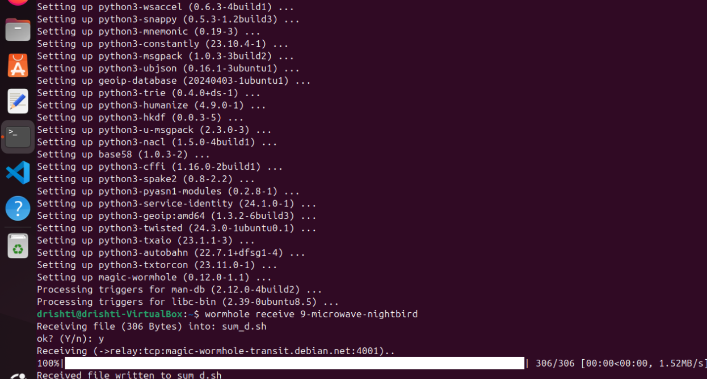
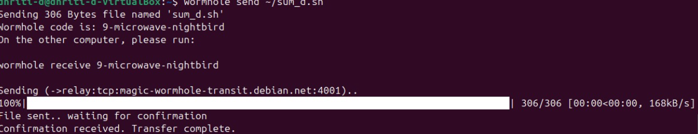

# File Transfer Between Different Networks (Using Magic Wormhole)

Hey 👋  
This guide shows how I received a file  (like `file.sh`) to my system, even when both are on **different networks**, using a secure tool called **Magic Wormhole** 🔐  

---

## ⚙️ Step 1: Install Magic Wormhole

👉 On **both** systems (sender and receiver):

```bash
sudo apt install magic-wormhole
````

🧠 This installs a small, secure command-line tool that creates a temporary encrypted link between two devices.

---

## 👩‍💻 Step 2: Sender Side 

1. Go to the folder where your file is located (in this case, `home`):

   ```bash
   cd ~
   ```
2. Send the file using wormhole:

   ```bash
   wormhole send file.sh
   ```
3. You’ll see a code appear, like this 👇

   ```
   Wormhole code is: 9-night-bird
   ```

✨ Keep this terminal open until the receiver finishes downloading!

---

## 💻 Step 3: Receiver Side (Your System)

1. In your terminal, type:

   ```bash
   wormhole receive 9-night-bird
   ```

   
2. Wait a few seconds ⏳
   The file will download to your **current directory**.

3. Check it’s there:

   ```bash
   ls
   ```

---

## 🔧 Step 4: Make It Executable (if it’s a shell script)

```bash
chmod +x file.sh
```

Then run it:

```bash
./file.sh
```

---

## 🛡️ Why Use Magic Wormhole?

✅ Works even on **different networks**
✅ **No need for public IP or port forwarding**
✅ Uses **encryption** for safe transfer
✅ Super simple — just share the one-time code 🔢

---

## 🧩 Example Recap

| Person            | Command Used               | Description              |
| :---------------- | :------------------------- | :----------------------- |
|  (Sender) | `wormhole send ~/file.sh` | Uploads file & gets code |
| You (Receiver)    | `wormhole receive <code>`  | Downloads file securely  |


# RECEIVER'S LINUX SCREEN :




# SENDER'S LINUX SCREEN :

