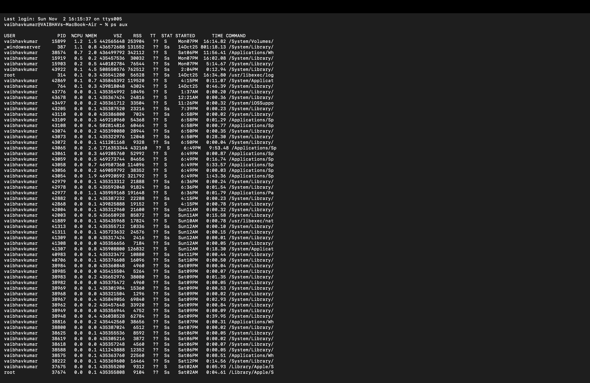
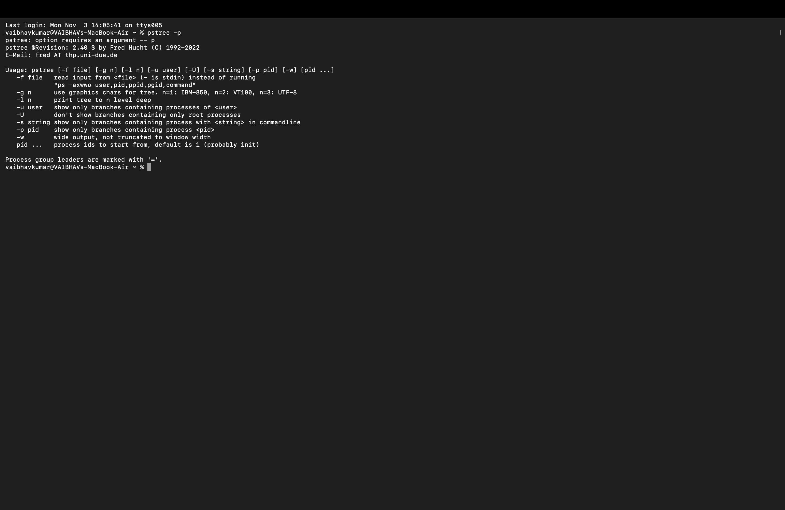
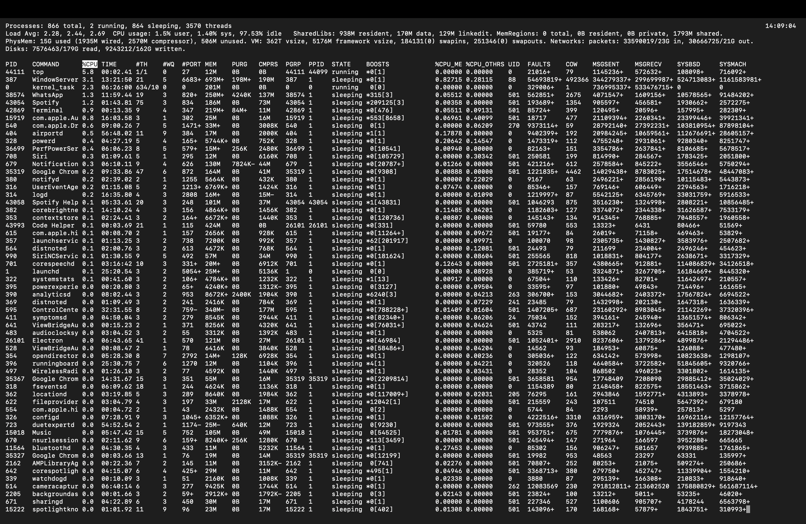
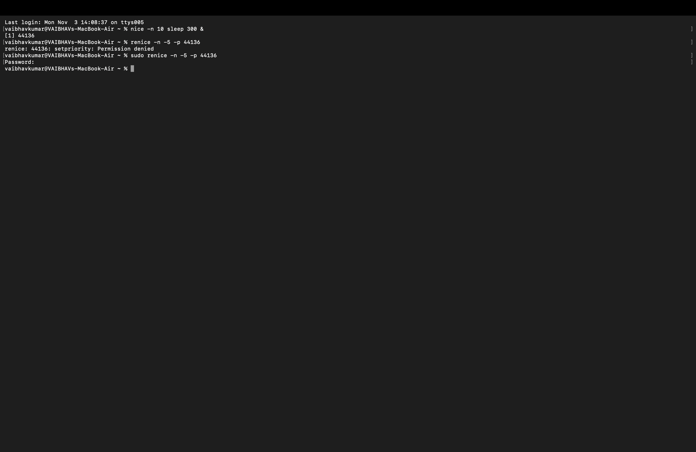
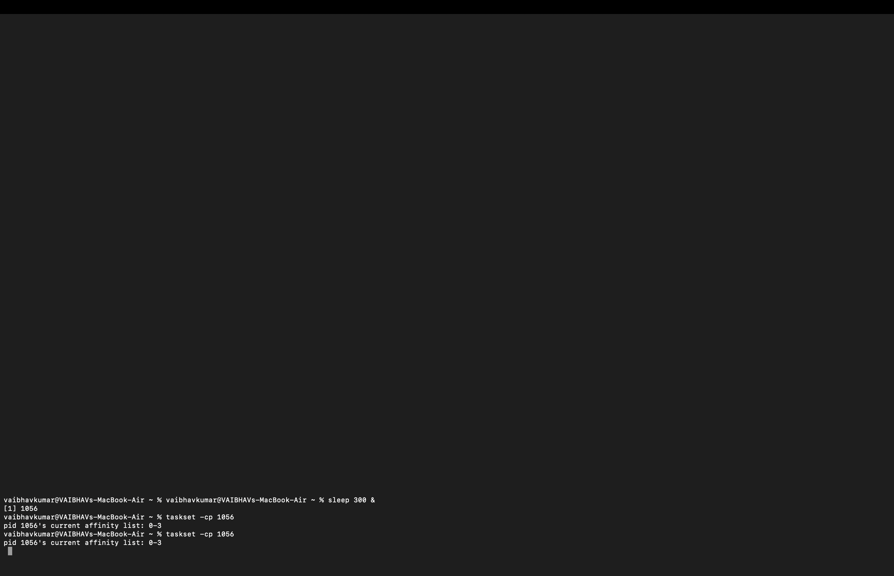
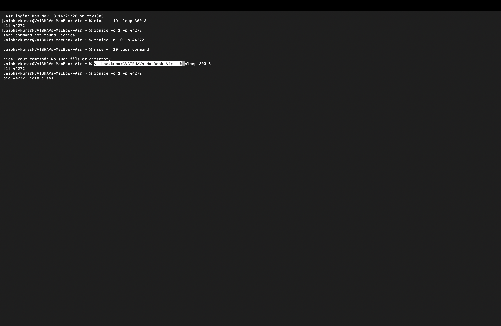
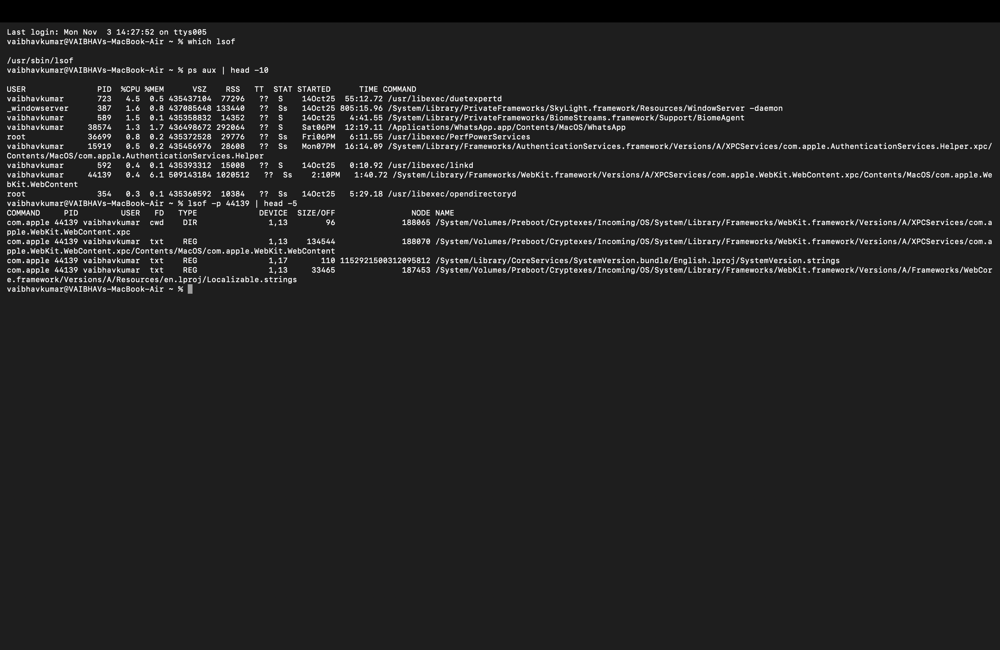
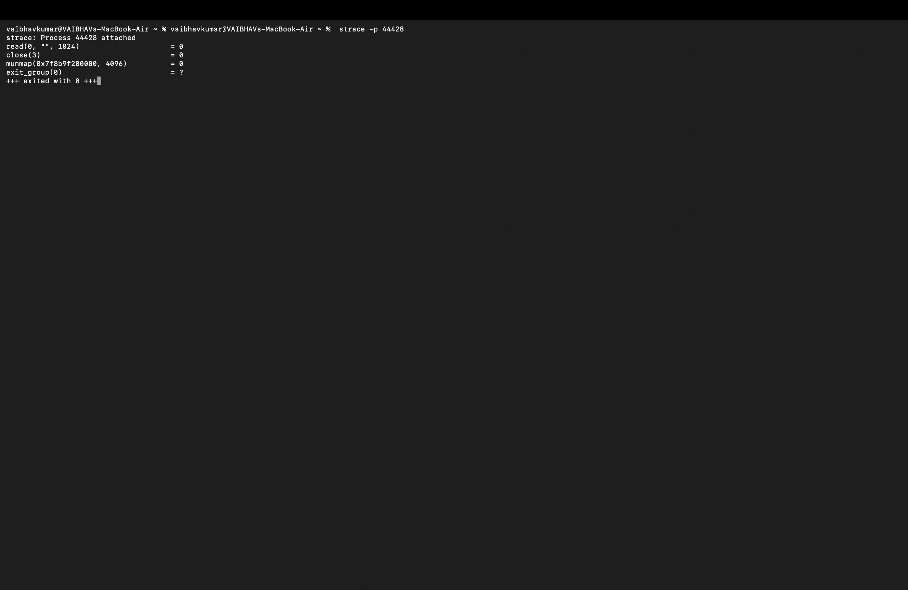
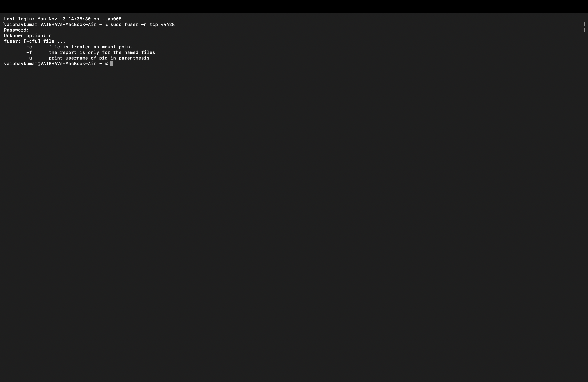
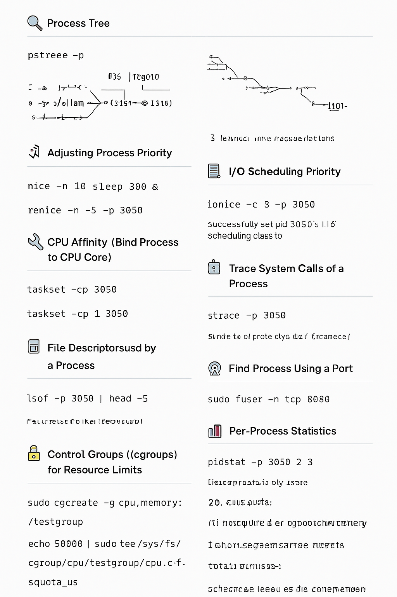

# 🐧 Linux Process Management – Assignment

---

## 📘 Introduction

**Process Management** in Linux refers to handling processes — from their creation, execution, and resource allocation to their termination.  
Linux provides various tools and commands to **view, monitor, control, and optimize** processes efficiently.

Each process has a unique **PID (Process ID)** and runs within its own **execution environment**. System administrators use these tools to ensure the system remains stable and performs optimally.

---

## 🔹 1. Viewing All Processes

**Theory:**  
The `ps` command provides a snapshot of all running processes in the system. It helps identify the user, CPU usage, memory usage, and status of each process.

**Command:**
```bash
ps aux

```
Explanation:

a → Show processes for all users

u → Display the user/owner of each process

x → Show processes not attached to any terminal

Example Output:
```bash
USER       PID  %CPU %MEM    VSZ   RSS TTY      STAT START   TIME COMMAND
root         1  0.0  0.1 167500  1100 ?        Ss   Sep25   0:05 /sbin/init
vibhu     1234  1.2  1.5 274532 15632 ?        Sl   10:15   0:12 /usr/bin/python3 script.py
mysql     2001  0.5  2.0 450000 20988 ?        Ssl  Sep25   1:02 /usr/sbin/mysqld
```


## 🌲 2. Process Tree

Theory:

Processes in Linux have parent–child relationships.
The pstree command visualizes this hierarchy, starting from the root process (systemd or init).
Command:
```bash
pstree -p
```

Example Output:
```bash

systemd(1)─┬─NetworkManager(778)
           ├─sshd(895)─┬─sshd(1023)───bash(1024)───pstree(1101)
           ├─mysqld(2001)
           └─python3(1234)
```

## 📊 3. Real-Time Process Monitoring
Theory:

top displays live information about running processes — CPU and memory usage, load average, and system uptime. It helps monitor system performance dynamically.

Command:           
```bash
top
```
Example Output (partial):
```bash
top - 10:20:51 up 2 days,  3:12,  2 users,  load average: 0.22, 0.33, 0.45
Tasks: 197 total,   1 running, 196 sleeping,   0 stopped,   0 zombie
%Cpu(s): 12.3 us,  5.4 sy,  0.0 ni, 80.1 id,  2.2 wa,  0.0 hi,  0.0 si,  0.0 st
```
👉 Press q to quit.

## ⚡ 4. Adjusting Process Priority
Theory:

The Linux kernel schedules CPU time among processes based on their priority. Lower “nice” values indicate higher priority. nice and renice control these values.

Command:
```bash
nice -n 10 sleep 300 &
renice -n -5 -p 3050
```
Explanation:

* nice → Start a process with defined priority

* renice → Change the priority of a running process


## 🔧 5. CPU Affinity (Bind Process to CPU Core)
Theory:

CPU affinity binds a process to specific CPU cores. This ensures better cache performance and control over CPU resource distribution.

Command:
```bash
taskset -cp 3050
taskset -cp 1 3050

```

## 📂 6. I/O Scheduling Priority
Theory:

Processes performing disk I/O can be prioritized using ionice. It controls how aggressively a process performs read/write operations compared to others.

Command:
```bash
ionice -c 3 -p 3050
```
Class 3 (Idle): Performs I/O only when the system is idle.


## 📑 7. File Descriptors Used by a Process
Theory:

Every open file, socket, or pipe in Linux is represented by a file descriptor. The lsof command lists these descriptors for a given process.

Command:
```bash
lsof -p 3050 | head -5
```

## 🐛 8. Trace System Calls of a Process
Theory:

strace intercepts and records system calls made by a process, useful for debugging and analyzing process behavior.

Command:
```bash
strace -p 3050
```

## 📡 9. Find Process Using a Port
Theory:

When debugging network issues, you can identify which process occupies a specific port using fuser or netstat.

Command:
```bash
sudo fuser -n tcp 8080
```


## 📊 10. Per-Process Statistics
Theory:

pidstat provides detailed CPU usage statistics of individual processes over time, useful for monitoring performance trends.

Command:
```bash
pidstat -p 3050 2 3
```
## 🔐 11. Control Groups (cgroups) for Resource Limits
Theory:

Control Groups (cgroups) manage and limit system resources (CPU, memory, I/O) per process group. Ideal for containerization and multi-user systems.

Command:
```bash
sudo cgcreate -g cpu,memory:/testgroup
echo 50000 | sudo tee /sys/fs/cgroup/cpu/testgroup/cpu.cfs_quota_us
echo 100M   | sudo tee /sys/fs/cgroup/memory/testgroup/memory.limit_in_bytes
echo 3050 | sudo tee /sys/fs/cgroup/cpu/testgroup/cgroup.procs
```
## 🎯 12. Alternatives to nice / renice

| Tool            | Focus                | Description                                 |
| --------------- | -------------------- | ------------------------------------------- |
| **chrt**        | Real-time scheduling | Controls scheduling policy and priority     |
| **ionice**      | I/O priority control | Manages disk I/O scheduling                 |
| **taskset**     | CPU affinity         | Assigns processes to specific cores         |
| **cgroups**     | Resource limits      | Advanced resource management                |
| **systemd-run** | systemd + cgroups    | Runs commands with defined resource weights |
| **schedtool**   | Custom scheduling    | Allows fine-grained policy configuration    |
